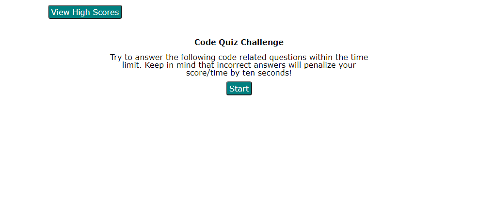
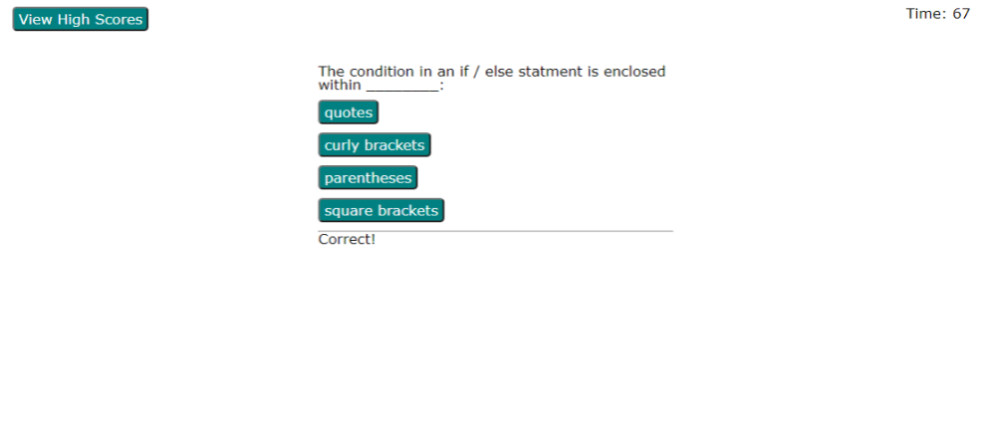
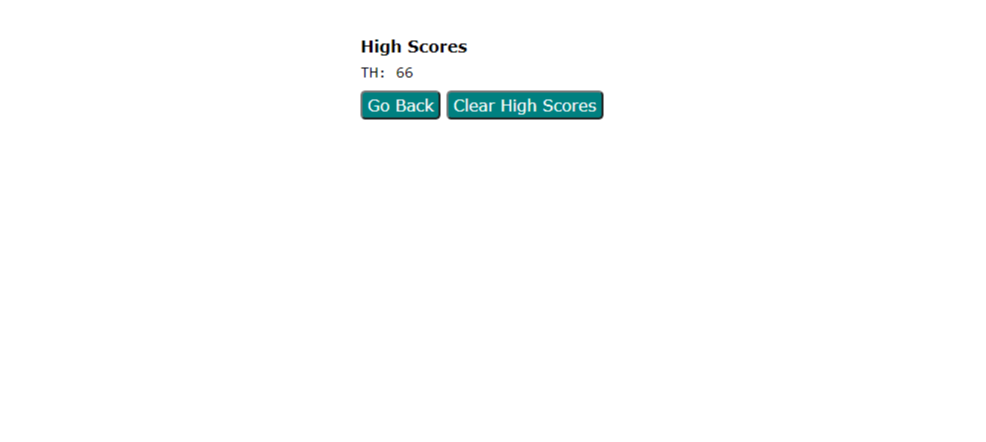

# Code Quiz Challenge

## Description
This project is a quiz of web development coding questions. It was created with HTML, CSS, and JavaScript.

When you press the **start** button, the screen changes to display a question with four answers, and a 75 second countdown clock starts running. As each question is answered, it moves to the next question and displays either **Correct!** or **Wrong!** for the prior answer for one second beneath the new answer list.

Each wrong answer results in ten seconds being removed from the remaining time.

When the last question is answered, it shifts to another view that shows your score and lets you enter your initials and displays them on the high scores list.

You can then go back to the start or clear the high scores.

## Page Link
The project can be viewed at <https://tharveyster.github.io/code-quiz/>.

## Screenshots

## License
Copyright 2021 Todd Harvey

Permission is hereby granted, free of charge, to any person obtaining a copy of this software and associated documentation files (the "Software"), to deal in the Software without restriction, including without limitation the rights to use, copy, modify, merge, publish, distribute, sublicense, and/or sell copies of the Software, and to permit persons to whom the Software is furnished to do so, subject to the following conditions:

The above copyright notice and this permission notice shall be included in all copies or substantial portions of the Software.

THE SOFTWARE IS PROVIDED "AS IS", WITHOUT WARRANTY OF ANY KIND, EXPRESS OR IMPLIED, INCLUDING BUT NOT LIMITED TO THE WARRANTIES OF MERCHANTABILITY, FITNESS FOR A PARTICULAR PURPOSE AND NONINFRINGEMENT. IN NO EVENT SHALL THE AUTHORS OR COPYRIGHT HOLDERS BE LIABLE FOR ANY CLAIM, DAMAGES OR OTHER LIABILITY, WHETHER IN AN ACTION OF CONTRACT, TORT OR OTHERWISE, ARISING FROM, OUT OF OR IN CONNECTION WITH THE SOFTWARE OR THE USE OR OTHER DEALINGS IN THE SOFTWARE.

##Contact Info
Email: todd@theharveysplace.com
